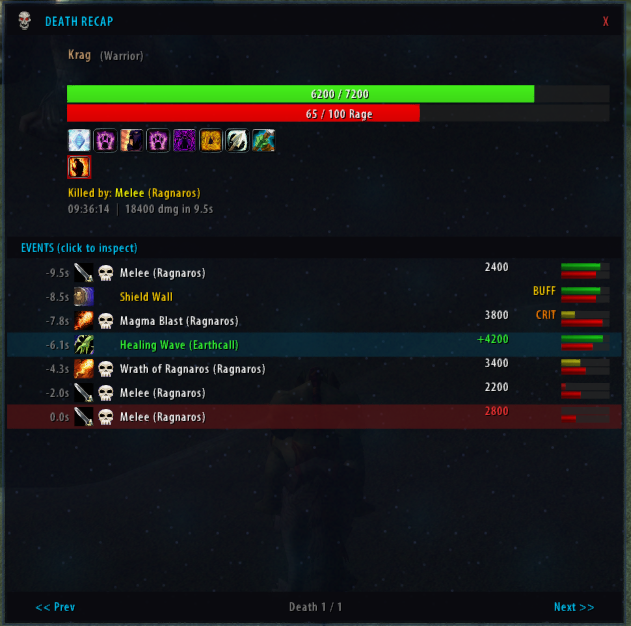

# Parsec - Damage Meter

> **Early Alpha** - Core functionality works, but not feature-complete and minimally tested. Expect bugs. Bug reports welcome via the Debug panel (copy-paste log).

A lightweight combat analysis addon for **TurtleWoW** (WoW 1.12.1), built on **SuperWoW** and **Nampower** for accurate combat data that vanilla addons can't provide.


*(fake data — no one was kicked from the raid for bad performance ;)*

## Requirements

- [SuperWoW](https://github.com/balakethelock/SuperWoW) - Extended combat log with source/target GUIDs, spell IDs, absorbs
- [Nampower](https://github.com/pepopo978/nampower) - Spell queue + SPELL_ENERGIZE events for mana/energy tracking
- WoW Client 1.12.1 (TurtleWoW)

**Both extensions are mandatory.** Without them, Parsec cannot identify combat event sources and will not function.

## Why Parsec?

Traditional vanilla damage meters (DPSMate, SW_Stats, KLHThreatMeter) are limited by the WoW 1.12 combat log, which only provides text strings without structured data. Parsec takes a different approach:

- **SuperWoW structured events** - Instead of regex-parsing combat log strings, Parsec uses SuperWoW's extended events that provide source GUID, target GUID, spell ID, and damage components as discrete values. This eliminates the fragile pattern matching that breaks on localized clients or unusual spell names.
- **Per-player DPS duration** - Most meters divide total damage by the global fight duration, inflating DPS for players who joined late or died early. Parsec tracks each player's first and last combat action and calculates DPS based on their individual activity window.
- **Multi-window views** - Open Damage, DPS, Healing, and HPS simultaneously in separate windows, each with independent segment selection (Overall vs. Current Fight). No tab-switching needed.
- **Pet & totem attribution** - Pet and totem damage is automatically merged with the owner using GUID-based tracking, not name heuristics.

## Features

- **Damage** and **DPS** tracking (per-player activity duration)
- **Healing**, **Effective Healing** and **HPS** tracking (overheal separated)
- **Pet & totem merge** - attribute pet/totem damage to owner via GUID
- **Multi-window** - open multiple views simultaneously
- **Segment support** - Overall vs. Current Fight per window
- **Window persistence** - positions, sizes, views and segments saved per character
- **Class colors** - standard WoW class coloring with hash-based fallback for unknown units
- **Fight history** - save past combat segments for post-fight review (configurable limit, right-click segment button to select)
- **Custom bar textures** - Solid, Gradient, Striped, Glossy, Smooth, Flat, Ember, Rain
- **Font outline & shadow** - toggle outline/shadow for bar text readability
- **Spell tooltip** - cursor-following tooltip with spell bars, accurate crit% column (excludes DoT ticks), and adjustable opacity
- **Clickable title bar** - click segment indicator to toggle Current/Overall, click view label to cycle metrics
- **Minimap button** - left-click toggle windows, right-click options, middle-click reset
- **Options panel** - dark themed UI with sidebar navigation (see below)
- **Debug panel** - message log (last 500 messages) with copy-paste for bug reports
- **Death Log** - track all deaths with per-player death counts in the main window
- **Death Recap panel** - detailed post-mortem analysis with split layout: unit frame (HP bar, resource bar, buff/debuff icons) + clickable event log with spell icons
- **Outgoing attack tracking** - damage dealt by the dying player shown in orange with "spell -> target" format, clearly distinguishable from incoming damage
- **Death event timeline** - ring buffer captures the last 50 combat events per player (incoming damage, heals, misses, buffs, outgoing attacks) with HP, resource, and aura snapshots
- **Death navigation** - browse through all deaths per player with Prev/Next buttons, mousewheel scrolling
- **Interactive event inspection** - click any event row to see the player's full state (HP, mana/rage/energy, buffs, debuffs) at that moment
- **Death notifications** - chat notification when a group member dies (toggleable)
- **Auto-popup death recap** - automatically show death recap when you die (toggleable)
- **Module toggles** - enable/disable individual tracking modules (Damage, Healing, Deaths) from the options panel
- **Auto show/hide** windows on combat start/end
- **Lock windows** to prevent accidental moving




## Installation

1. Install **SuperWoW** and **Nampower** (see links above)
2. Copy the `Parsec` folder to `Interface\AddOns\`
3. Restart the WoW client

## Slash Commands

| Command | Description |
|---|---|
| `/parsec` | Toggle all windows |
| `/parsec show` / `hide` | Show or hide all windows |
| `/parsec reset` | Reset all combat data |
| `/parsec options` | Open options panel |
| `/parsec minimap` | Toggle minimap button |
| `/parsec debug` | Toggle debug mode |
| `/parsec pets` | Show pet-owner cache |
| `/parsec stats` | Show event statistics |
| `/parsec history` | List saved fight segments |
| `/parsec deaths` | Switch main window to Deaths view |
| `/parsec dr` / `deathrecap` | Open Death Recap panel |
| `/parsec fake` | Generate fake data for testing |
| `/parsec help` | List all commands |

## Options Panel

- **Bars** - Bar height, spacing, texture picker, font shadow, font outline, pet merge toggle
- **Window** - Backdrop visibility, opacity, tooltip opacity, lock positions, click-to-cycle toggle, reset actions
- **Automation** - Auto show/hide on combat, minimap button, track-all toggle, max fight history slider, clear history
- **Modules** - Enable/disable individual tracking modules (Damage/DPS, Healing/HPS, Deaths)
- **Deaths** - Auto-popup death recap, death notifications, recap panel opacity
- **About** - Version info and command reference
- **Debug** - Message log buffer with Select All / Clear / Refresh

## Known Limitations (Alpha)

- Only tested in solo and small group content
- Raid (40-man) tested once successfully, but needs ongoing validation after major changes
- Threat tracking not implemented

## Architecture

```
Parsec/
  core/
    utils.lua         - Global namespace, class colors, print/debug with log buffer
    eventbus.lua      - Combat log parsing (SuperWoW structured events)
    combat-state.lua  - In-combat detection, segment management
    data-store.lua    - Player data aggregation, sorting, segments
    debug.lua         - Debug mode toggle, stats, event dump
    settings.lua      - Settings defaults, load/save/apply
    consumables.lua   - SpellID→ItemID mappings for potions, elixirs, flasks, etc.
    bootstrap.lua     - Initialization, slash commands, event wiring
  modules/
    damage.lua        - Damage event handlers
    healing.lua       - Healing event handlers
    death.lua         - Death tracking, intake ring buffer, death records
  ui/
    window.xml        - XML templates for window frames
    window.lua        - Window creation, resize, title bar, bar rendering
    minimap-button.lua- Draggable minimap icon
    options.lua       - Options panel (sidebar + lazy-built panels)
    deathlog.lua      - Death Recap panel UI
  textures/           - Custom TGA textures (bars, icons, window chrome)
```

## Changelog

### v0.5.4 (2026-03-06)
- **Fix crash: `/parsec events` dead code** — `ShowEvents()` referenced removed ring buffer fields. Replaced with `ShowMissedEvents()` that reads from the missed events log.
- **Fix shared aura cache references** — `GetCachedAuras()` now returns shallow copies of cached arrays, preventing multiple intake entries from sharing the same buff/debuff table references.
- **Performance: intake entry table pool** — Evicted ring buffer entries are recycled via an object pool instead of being garbage-collected. All 5 PushIntake call sites use the pool.
- **Performance: FindSourceRaidTarget cache** — Expensive raid-member target scanning now uses a 0.5s TTL cache, avoiding repeated 40-member iterations on every intake event.
- **Fix greedy regex in pet melee patterns** — Added trailing `%.` anchor to `CHAT_MSG_COMBAT_PET_HITS/CRITS` patterns to prevent partial matches on ambiguous target names.
- **Performance: throttled totem cast log pruning** — Totem log cleanup now runs in-place every 30s instead of creating a new table on every totem cast.

### v0.5.3 (2026-03-05)
- **Fix missing ~50% pet/totem damage** — Added `CHAT_MSG_SPELL_PET_DAMAGE`, `CHAT_MSG_COMBAT_PET_HITS`, and `CHAT_MSG_SPELL_PERIODIC_CREATURE_DAMAGE` handlers for 100% reliable own-pet/totem damage capture. Nampower `_OTHER` events are range-limited and drop pet damage when the player moves away from totems. CHAT_MSG events always fire regardless of range.
- **Fix memory consumption (75MB → <5MB)** — Replaced per-event `SnapshotAuras()` calls (~47k/fight, each creating ~25 sub-tables) with a throttled 2-second TTL aura cache. Added spell name cache to avoid repeated `SpellInfo()` string allocations. Removed debug ring buffer. Added negative pet GUID cache to skip expensive 40-member raid scans for confirmed non-pet GUIDs.
- **Own-pet dedup** — Skip own-pet damage from Nampower `_OTHER` events since CHAT_MSG handlers capture it more reliably. No double-counting possible.
- **Cache cleanup** — All caches (negative pet GUIDs, aura snapshots) are cleared on combat end to prevent unbounded growth.
- **Performance: reusable event data tables** — EventBus handlers now reuse pre-allocated tables instead of creating new ones per combat event (~100+/sec in raids). Eliminates the #1 source of GC pressure (216 kB in pfDebug).
- **Performance: single window update timer** — Replaced per-window `OnUpdate` handlers with a single shared `ParsecWindowTimer` frame. Cuts OnUpdate call count from N*fps to 1*fps for timer checks.
- **Performance: P.Debug early return** — Debug logging now skips all string concatenation and table operations when debug mode is off. Previously every call allocated strings even with debug disabled.
- **Performance: pet scan only in group** — `ParsecEventBus:OnUpdate` pet scan timer now short-circuits when solo (no raid/party members), avoiding unnecessary work every frame.
- **Performance: reusable sort pool** — `GetSorted()` now reuses pre-allocated entry tables and sorted array instead of creating 40+ new tables per call in raids. Sort comparator created once as upvalue instead of per-call closure.
- **Performance: bar value caching** — Bar text formatting (`string.format`, `SetText`) only runs when the displayed value actually changes. Eliminates all string allocation when data is static (out of combat).

### v0.5.2 (2026-03-05)
- **Fix crit% calculation** — periodic damage ticks (DoT: Fireball, Ignite, Pyroblast, etc.) are now excluded from the crit percentage denominator. Direct spell hits always set `SPELL_HIT_TYPE_UNK1 (0x01)` in hitInfo, while periodic ticks from `SMSG_PERIODICAURALOG` have hitInfo=0. Crit% now shows `crits / directHits` instead of `crits / allHits`, giving accurate values for spells with DoT components. Same fix applied to healing (HoT ticks excluded via Nampower's explicit periodic flag in arg6).
- **Consumable icon system** — 128 spellID→itemID mappings for potions, elixirs, flasks, healthstones, bandages, runes, juju, and TurtleWoW custom items. Death Recap now shows correct item icons and full item names instead of generic spell fallbacks.
- **Consumable categories** — Healing/Mana/Rejuvenation Potions, Troll's Blood, Rage Potions, Healthstones (including Improved), Protection Potions, Utility Potions, Flasks, Battle/Guardian/Detection Elixirs, Juju, Runes, Bandages (including BG variants), Food/Drink, TurtleWoW custom (Nordanaar Herbal Tea)

### v0.5.1 (2026-03-05)
- **Death Recap v2** — complete redesign with split layout: unit frame + interactive event log
- **Unit frame** — class icon, HP bar (green→red), class-dependent resource bar (Mana/Rage/Energy), buff and debuff icon grids with mouseover tooltips
- **Clickable event rows** — click any event to inspect the player's full state (HP, resource, auras) at that timestamp
- **Spell icons** — event rows display spell icons from SuperWoW SpellInfo, with school-color fallback
- **Raid target markers** — skull, cross, triangle etc. shown next to source names in event rows (historical: captures the marker at event time, not current)
- **Mini HP/resource bars** — each event row shows a graphical HP and resource bar reflecting the player's state after that event, with exact values on mouseover
- **Multi-row buff/debuff display** — up to 32 buff and 32 debuff icons with multi-row wrapping, overflow "+N" indicator with tooltip listing hidden auras
- **Debuff type borders** — debuff icons show colored borders by type (Magic=blue, Curse=purple, Disease=brown, Poison=green)
- **Aura snapshots** — each intake event captures all buffs/debuffs (32 buffs, 64 debuffs) and resource values for timeline inspection
- **Self-cast/buff tracking** — Shield Wall, Evasion and other self-buffs tracked as BUFF events in the death timeline
- **Spell icon cache** — efficient caching of SpellInfo lookups
- **Buff name scanning** — tooltip-scanning fallback ensures buff/debuff names always display correctly, even when SpellInfo is unavailable
- **Outgoing attack tracking** — damage dealt by the dying player shown in orange ("spell -> target" format) with OUT/CRIT flag, clearly distinguishable from incoming damage; ring buffer increased from 30 to 50 events
- **Granular death notifications** — master toggle + separate Own/Party/Raid sub-toggles with auto-disable when master is off

### v0.5.0 (2026-03-05)
- **Death Log** — comprehensive death tracking with per-player death counts in the main window Deaths view
- **Death Recap panel** — detailed post-mortem analysis: damage timeline with school colors, healing received, HP bar visualization, killing blow highlight, overkill calculation, prev/next navigation
- **Damage intake tracking** — ring buffer captures last 30 incoming damage/heal/miss events per player with real-time HP snapshots via SuperWoW
- **Auto-popup** — death recap automatically opens when you die (toggleable in Options > Deaths)
- **Death notifications** — chat message when a group member dies (toggleable)
- **Deaths options tab** — auto-popup toggle, notification toggle, recap panel opacity slider
- **Slash commands** — `/parsec deaths` (switch to Deaths view), `/parsec dr` (open Death Recap)
- **Fake data** — `/parsec fake` now generates 3 sample death records for testing

### v0.4.1 (2026-03-04)
- **Channels options tab** — standard + custom channels with checkboxes and ChatTypeInfo color swatches
- **Colored announce dropdown** — only enabled channels shown, each in its chat type color
- **Custom channel support** — dynamically discovered via GetChannelList(), correct channelId for SendChatMessage
- **Borderless title buttons** — Menu, >>, X as plain cyan text matching view label style
- **README changelog** — full version history added

### v0.4.0 (2026-03-04)
- **Fight history** — save past combat segments in memory for post-fight review (configurable max 1-25)
- **Segment dropdown** — right-click `[C]`/`[O]` to select from Current, Overall, and saved history segments with per-player values
- **Tooltip overhaul** — cursor-following tooltip with starry background, opacity setting, and dedicated crit% column
- **Fake data** — `/parsec fake` includes player's own character and generates 3 history segments
- **Bug fixes** — combat duration reset ordering, DAMAGESHIELDS resist parsing, MISSED event spam

### v0.3.x (2026-03-04)
- **Font shadow & outline** — toggle shadow/outline on bar text for readability (Options > Bars)
- **Texture picker** — 8 bar textures (Solid, Gradient, Striped, Glossy, Smooth, Flat, Ember, Rain) with realistic preview
- **Clickable title bar** — click segment indicator to toggle Current/Overall, click view label to cycle metrics
- **Custom spell tooltip** — per-spell bars with damage proportion, crit%, and overheal annotation

### v0.2.x (2026-03-03)
- **Multi-window** — open Damage, DPS, Healing, Effective Healing, HPS simultaneously
- **Segment support** — Overall vs. Current Fight per window
- **Window persistence** — positions, sizes, views saved per character
- **Options panel** — dark themed UI with sidebar navigation
- **Minimap button** — left-click toggle, right-click options, middle-click reset

### v0.1.x (2026-03-02)
- Initial release — damage and healing tracking with SuperWoW structured events
- Per-player DPS duration, pet & totem merge, class colors
- Auto show/hide on combat, debug panel

## License

All rights reserved.
