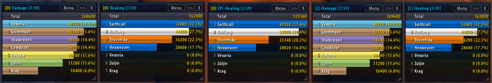
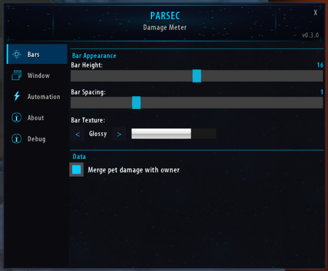

# Parsec - Damage Meter

> **Early Alpha** - Core functionality works, but not feature-complete and minimally tested. Expect bugs. Bug reports welcome via the Debug panel (copy-paste log).

A lightweight combat analysis addon for **TurtleWoW** (WoW 1.12.1), built on **SuperWoW** and **Nampower** for accurate combat data that vanilla addons can't provide.


*(fake data — no one was kicked from the raid for bad performance ;)*

## Requirements

- [SuperWoW](https://github.com/balakethelock/SuperWoW) - Extended combat log with source/target GUIDs, spell IDs, absorbs
- [Nampower](https://github.com/pepopo978/nampower) - Spell queue + SPELL_ENERGIZE events for mana/energy tracking
- WoW Client 1.12.1 (TurtleWoW)

**Both extensions are mandatory.** Without them, Parsec cannot identify combat event sources and will not function.

## Why Parsec?

Traditional vanilla damage meters (DPSMate, SW_Stats, KLHThreatMeter) are limited by the WoW 1.12 combat log, which only provides text strings without structured data. Parsec takes a different approach:

- **SuperWoW structured events** - Instead of regex-parsing combat log strings, Parsec uses SuperWoW's extended events that provide source GUID, target GUID, spell ID, and damage components as discrete values. This eliminates the fragile pattern matching that breaks on localized clients or unusual spell names.
- **Per-player DPS duration** - Most meters divide total damage by the global fight duration, inflating DPS for players who joined late or died early. Parsec tracks each player's first and last combat action and calculates DPS based on their individual activity window.
- **Multi-window views** - Open Damage, DPS, Healing, and HPS simultaneously in separate windows, each with independent segment selection (Overall vs. Current Fight). No tab-switching needed.
- **Pet & totem attribution** - Pet and totem damage is automatically merged with the owner using GUID-based tracking, not name heuristics.

## Features

- **Damage** and **DPS** tracking (per-player activity duration)
- **Healing**, **Effective Healing** and **HPS** tracking (overheal separated)
- **Pet & totem merge** - attribute pet/totem damage to owner via GUID
- **Multi-window** - open multiple views simultaneously
- **Segment support** - Overall vs. Current Fight per window
- **Window persistence** - positions, sizes, views and segments saved per character
- **Class colors** - standard WoW class coloring with hash-based fallback for unknown units
- **Fight history** - save past combat segments for post-fight review (configurable limit, right-click segment button to select)
- **Custom bar textures** - Solid, Gradient, Striped, Glossy, Smooth, Flat, Ember, Rain
- **Font outline & shadow** - toggle outline/shadow for bar text readability
- **Spell tooltip** - cursor-following tooltip with spell bars, crit% column, and adjustable opacity
- **Clickable title bar** - click segment indicator to toggle Current/Overall, click view label to cycle metrics
- **Minimap button** - left-click toggle windows, right-click options, middle-click reset
- **Options panel** - dark themed UI with sidebar navigation (see below)
- **Debug panel** - message log (last 500 messages) with copy-paste for bug reports
- **Auto show/hide** windows on combat start/end
- **Lock windows** to prevent accidental moving



## Installation

1. Install **SuperWoW** and **Nampower** (see links above)
2. Copy the `Parsec` folder to `Interface\AddOns\`
3. Restart the WoW client

## Slash Commands

| Command | Description |
|---|---|
| `/parsec` | Toggle all windows |
| `/parsec show` / `hide` | Show or hide all windows |
| `/parsec reset` | Reset all combat data |
| `/parsec options` | Open options panel |
| `/parsec minimap` | Toggle minimap button |
| `/parsec debug` | Toggle debug mode |
| `/parsec pets` | Show pet-owner cache |
| `/parsec stats` | Show event statistics |
| `/parsec history` | List saved fight segments |
| `/parsec fake` | Generate fake data for testing |
| `/parsec help` | List all commands |

## Options Panel

- **Bars** - Bar height, spacing, texture picker, font shadow, font outline, pet merge toggle
- **Window** - Backdrop visibility, opacity, tooltip opacity, lock positions, click-to-cycle toggle, reset actions
- **Automation** - Auto show/hide on combat, minimap button, track-all toggle, max fight history slider, clear history
- **About** - Version info and command reference
- **Debug** - Message log buffer with Select All / Clear / Refresh

## Known Limitations (Alpha)

- Only tested in solo and small group content
- Raid (40-man) tested once successfully, but needs ongoing validation after major changes
- No death log
- Threat tracking not implemented

## Architecture

```
Parsec/
  core/
    utils.lua         - Global namespace, class colors, print/debug with log buffer
    eventbus.lua      - Combat log parsing (SuperWoW structured events)
    combat-state.lua  - In-combat detection, segment management
    data-store.lua    - Player data aggregation, sorting, segments
    debug.lua         - Debug mode toggle, stats, event dump
    settings.lua      - Settings defaults, load/save/apply
    bootstrap.lua     - Initialization, slash commands, event wiring
  modules/
    damage.lua        - Damage event handlers
    healing.lua       - Healing event handlers
  ui/
    window.xml        - XML templates for window frames
    window.lua        - Window creation, resize, title bar, bar rendering
    minimap-button.lua- Draggable minimap icon
    options.lua       - Options panel (sidebar + lazy-built panels)
  textures/           - Custom TGA textures (bars, icons, window chrome)
```

## Changelog

### v0.4.1 (2026-03-04)
- **Channels options tab** — standard + custom channels with checkboxes and ChatTypeInfo color swatches
- **Colored announce dropdown** — only enabled channels shown, each in its chat type color
- **Custom channel support** — dynamically discovered via GetChannelList(), correct channelId for SendChatMessage
- **Borderless title buttons** — Menu, >>, X as plain cyan text matching view label style
- **README changelog** — full version history added

### v0.4.0 (2026-03-04)
- **Fight history** — save past combat segments in memory for post-fight review (configurable max 1-25)
- **Segment dropdown** — right-click `[C]`/`[O]` to select from Current, Overall, and saved history segments with per-player values
- **Tooltip overhaul** — cursor-following tooltip with starry background, opacity setting, and dedicated crit% column
- **Fake data** — `/parsec fake` includes player's own character and generates 3 history segments
- **Bug fixes** — combat duration reset ordering, DAMAGESHIELDS resist parsing, MISSED event spam

### v0.3.x (2026-03-04)
- **Font shadow & outline** — toggle shadow/outline on bar text for readability (Options > Bars)
- **Texture picker** — 8 bar textures (Solid, Gradient, Striped, Glossy, Smooth, Flat, Ember, Rain) with realistic preview
- **Clickable title bar** — click segment indicator to toggle Current/Overall, click view label to cycle metrics
- **Custom spell tooltip** — per-spell bars with damage proportion, crit%, and overheal annotation

### v0.2.x (2026-03-03)
- **Multi-window** — open Damage, DPS, Healing, Effective Healing, HPS simultaneously
- **Segment support** — Overall vs. Current Fight per window
- **Window persistence** — positions, sizes, views saved per character
- **Options panel** — dark themed UI with sidebar navigation
- **Minimap button** — left-click toggle, right-click options, middle-click reset

### v0.1.x (2026-03-02)
- Initial release — damage and healing tracking with SuperWoW structured events
- Per-player DPS duration, pet & totem merge, class colors
- Auto show/hide on combat, debug panel

## License

All rights reserved.
